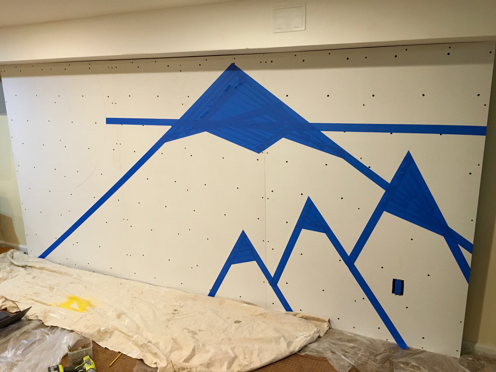

&copy; 2019 Jason Luther. All rights reserved. 

# DIY Basement Bouldering Wall

To introduce our kinds to rock climbing, we built a small bouldering wall in our basement. 

There are a lot of great resources for designing and building home rock climbing walls. [This REI article](https://www.rei.com/blog/climb/build-home-climbing-wall) is super comprehensive. I also got a lot of inspiration from [this I Like to Make Stuff build](https://iliketomakestuff.com/make-indoor-climbing-wall/). 

I wanted to start with the simplest design that would work in the space we have. You can always add more complicated elements later. 

This is a fun family build. The kids can help drill holes, drive screws, hammer in t-nuts, and paint. 

### Be safe

Any construction project can be dangerous or fatal, so please take appropriate safety precautions and consult a professional when you need help. 

Always wear safety glasses. I also recommend hearing protection and a respirator when the situation calls for it.  

Climbing can also be dangerous. Make sure the users of the wall know how to keep safe and that the area is clear of hazards. [This REI article](https://www.rei.com/blog/climb/build-home-climbing-wall) says it well: 

> The area underneath and around your wall must be made safe for falling. Ensure that this area is free of any objects that you could hit or land on in a fall. Never boulder over unpadded concrete, asphalt, wood, or any other hard surface. Falls directly onto an unprotected surface can result in serious head injury or even death. ...
> 
> There are several options for padding your fall zone including commercially available bouldering pads, old mattresses, or several layers of carpet padding. However you choose to prepare your fall zone, you must take the responsibility of making it safe very seriously. Artificial climbing holds regularly spin or break, resulting in violent, out-of-control falls. You must never put yourself or others in a position that could result in injury in the case of an unexpected fall.

I am not a professional, and I am just sharing my experience for information and entertainment purposes. I cannot be held responsible for any damage or injuries that result from actions you take. 

### Steps

These are the steps:

1. Design the wall
2. Build the frame
3. Prepare and install the plywood
4. Paint
5. Install the holds

## Materials & Tools

The structure of the wall is made from 2x3 studs and 3/4" sanded ACX plywood. 

The cost is going to vary based the size of your wall and how much hardware you need to securely connect it to the house/structure. I spent about $250 on all of the materials (excluding the paint, which was left over). 

I used [these climbing holds](https://www.rockymountainclimbinggear.com/bolt-on-holds-1), which come with bolts that use 3/8-16 T-nuts. 

The tools for this project are the typical tools you'd need for any home DIY project. Here's what I used: 

 * Drill/driver
 * Hammer
 * Circular saw
 * Speed square
 * Dead blow
 * Stud finder
 * Level
 * Tape measure
 * Painting supplies, including masking tape
 * Safety
   * Ear protection
   * Safety glasses
   * Respirator with 3M 2097 cartridge

## Design

The first step is to consider the space you have and decide on the features you want from your climbing wall. 

Our basement has a low ceiling with a soffit that carries some plumbing, and that's really the only space we had that would work. That gives us about 6' in height. 

Our kids are beginning climbers, so we're starting with a very slight tilt (about 1&deg;) and no crazy overhangs.  

Because the wall is nearly vertical, most of the load is carried by the concrete floor, so we don't need heavy-duty attachments to the wall and ceiling. 

We had enough room to make the wall a little longer, but I kept it at a multiple of 4' (the width of the plywood sheets) to keep the build simpler and minimize waste. 

## Frame

The frame is just like a typical wall frame with top and bottom plates. The studs are 24" apart, and they're doubled up where the plywood sheets meet. 

I predrilled the holes in the top and bottom plates before hammering in 3-1/2" 16D nails. Screws would also work fine. 

The frame was built in two sections (one 8' and one 4') that are screwed together. 

At the bottom, the frame rests on the floor. The weight of a climber should push it down and toward the basement wall. 

The ceiling is not a consistent height, so it took a lot of persuasion with the dead blow to get it into place. 

At the top, the frame is screwed to some 2x3s that are screwed into the wall studs and into the soffit framing with #10 3-1/2" screws. 

Because the climbing wall would cover an outlet, I also added some wood to support the installation of an electrical box. This has worked out okay so far, but I'm not sure that it was a good idea vs. moving the outlet to the side of the frame. 

## Plywood

The next step is to prepare the plywood: cutting it to size and then drilling holes for the holds. 

I cut the sheets to the right height using a circular saw. Our wall ended up being a little shy of 6'. 

Then I laid out the hole pattern for the holds. After looking at different examples online, I settled on an offset pattern with rows of 5 holes. In hindsight, I should have stayed a little further away from the edges. 

I screwed the three sheets of plywood together and then started drilling the 7/8" holes to hold the t-nuts. I set the stack on top of some 2x3s and made sure to have a 2x3 behind the row I was drilling to minimize tear-out. 

Then I hammered in the t-nuts. It's important to get them flat and to make sure they're driven in all the way. If they're loose, it's easy to accidentally poke them out when you're trying to install holds. 

This one is a bit loose: 

The last step was to mount the sheets to the frame using 2-1/2" deck screws. I predrilled to avoid splitting the studs. 

## Paint

At this point in the project, I was ready to declare victory. I was not even planning to varnish or paint the wall. 

But my family had a different plan. 

We decided to paint a design. Here's what my 8-year-old daughter proposed: 

I made a quick sketch on the computer to see what it would look like using the wall dimensions and straight lines. 

Our color palate was determined by the leftover house paint we had available. 

I laid out the design using painter's tape, using the holes as a guide for the horizon. 

To draw the sun, I drive a nail in the center and attached a string to a pencil. Then I painted it by hand, frequently using a wet rag to wipe off mistakes and start over. 

To paint the mountains, we started with the background and progressed through the "layers" to the foreground. At each step, we had to cut away the tape on the side from the "snow" and then add new tape over the area that was just painted. Then we could paint the inside of the mountain and repeat. 

Here's the final product: 

## Holds

The last step is to install the holds, which came with bolts. It's straightforward, but it's possible to push the t-nut out of the hole if you're not careful. One day I'll retrieve the ones that fell out, but for now we are just going to skip those holes. 

We put up some holds and then added more as the kids tried out different routes. We've since added more. 

With the holds in place and tightened by an adult, the only thing left to do is climb on!

